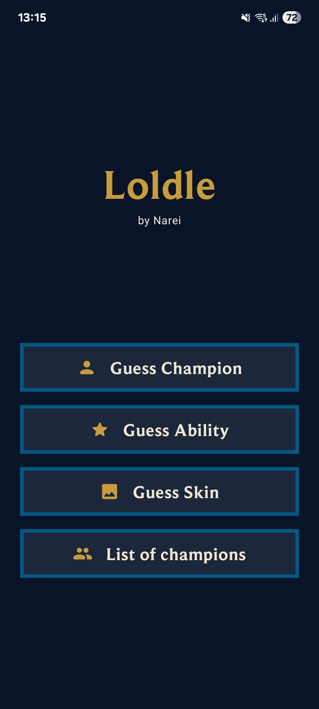
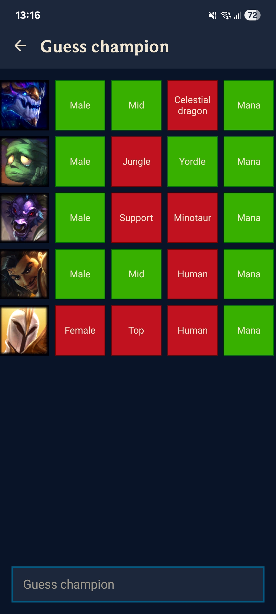
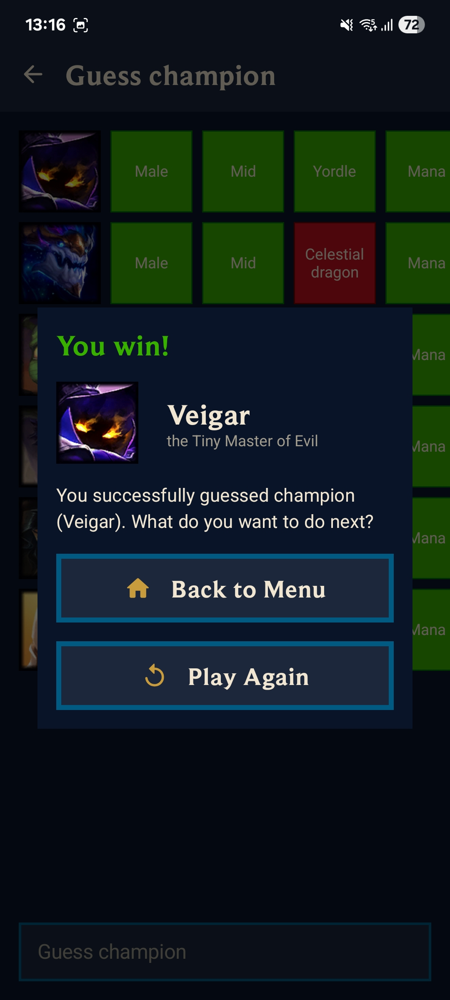
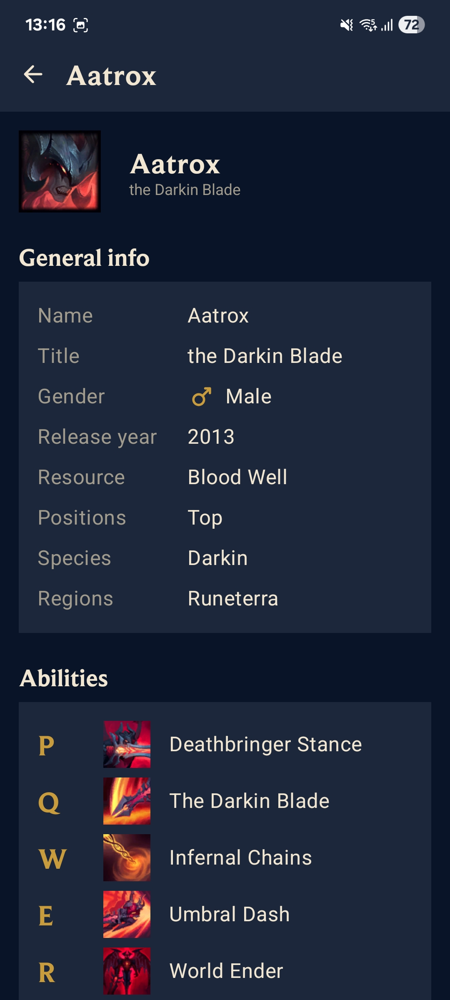
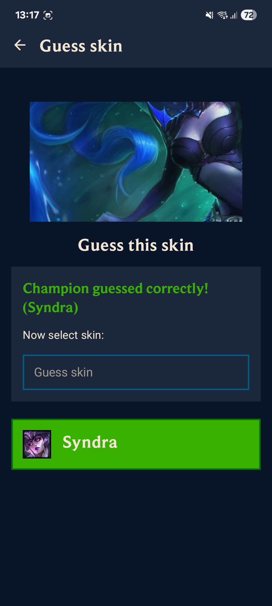
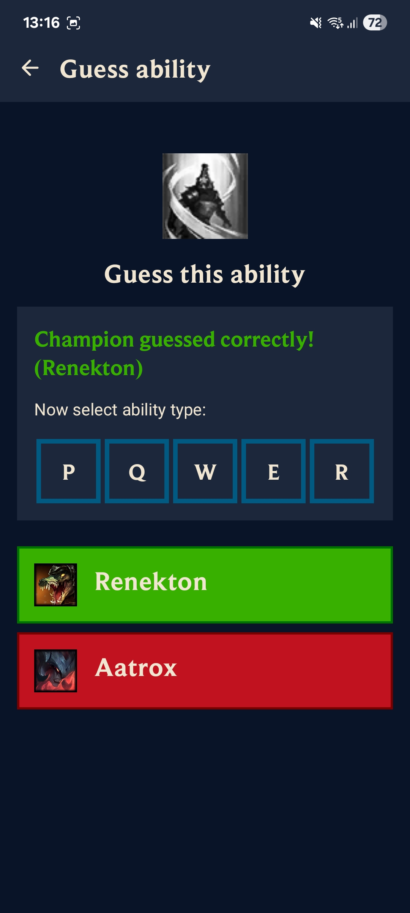

# Loldle

An Android guessing game inspired by Wordle, but for League of Legends champions. Try to guess the champion based on attributes like role, region, species, release year and more. Each guess reveals which attributes match, helping you narrow down the answer.

## Demo & Screenshots

<p align="center">
  
  &nbsp;&nbsp;&nbsp;
  
  &nbsp;&nbsp;&nbsp;
  
  &nbsp;&nbsp;&nbsp;
  
  &nbsp;&nbsp;&nbsp;
  
  &nbsp;&nbsp;&nbsp;
  
</p>

## Features

* **Classic Mode:** Guess the champion based on attributes like lane, gender, species, region, release year and more. Each guess reveals which properties match the target.
* **Ability Mode:** Identify the champion by looking at an ability icon — test your knowledge of every spell in the game.
* **Splash Art Mode:** Guess the champion and their skin from a cropped fragment of a splash art.
* **Champion Wiki:** Browse all champions with their full attribute details, abilities and available skins.

## Data source

Champion data is generated by **[Loldle Data](https://github.com/iEranDEV/loldle-data)** — a Kotlin utility that scrapes and aggregates champion information from Riot's Data Dragon API and the League of Legends Wiki into a structured JSON file consumed by this app.

## Tech stack

| Layer | Technology |
|-------|------------|
| Language | **Kotlin** |
| UI | **Jetpack Compose + Material 3** |
| Navigation | **Navigation Compose** |
| DI | **Koin** |
| Images | **Coil** |

## Build & Run

1. Clone the repository

```
git clone https://github.com/iEranDEV/loldle.git
```

2. Open in Android Studio and sync Gradle

3. Run on an emulator or connected device

```
./gradlew installDebug
```

### Disclaimer

This project isn't endorsed by Riot Games and doesn't reflect the views or opinions of Riot Games or anyone officially involved in producing or managing Riot Games properties. Riot Games, and all associated properties are trademarks or registered trademarks of Riot Games, Inc.
